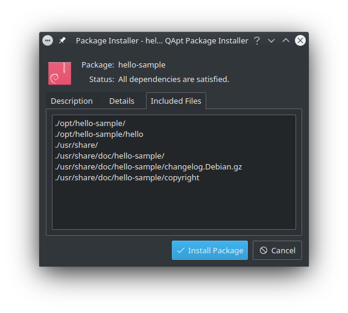

# Building Ubuntu (.deb) package starter

> **note**: this is copy of [Building Ubuntu (.deb) package starter](https://sansajn.github.io/post/2021/01/12/building-deb-package.html) article

Building installable package can be handy in situation you decide to distribute your software to somebody else. In this post I will describe how we can build *deb* package for *Ubuntu* and *Debian* systems.

> we will use *Ubuntu 20.04 LTS* in your case

## Prepare `debian/` directory content

Package metadata used to build *deb* package are stored in `debian/` directory. The most interestig ones are `control`, `rules`, `changelog`, `compat` and `copyright` files. Full files specification can be found in [Debian New Maintainers' Guide](https://www.debian.org/doc/manuals/maint-guide/index.en.html) sections 4 and 5.

For the purpose of this article we will use onces from [*ubuntu-package-starter*](https://github.com/sansajn/ubuntu-package-starter) sample repository. Clone the repository with

```bash
git clone https://github.com/sansajn/ubuntu-package-starter.git
```

> `git` can be installed with `sudo apt install git` command

command. We now heve our sample in `ubuntu-package-starter` directory, but before we can build *deb* package we need to setup *pbuilder*.


## Default *pbuilder* setup

First we need to install *pbuilder* package and some other dependencies with

```bash
sudo apt install pbuilder debhelper
```

command. Then we need to create a default base chroot image tar-ball (`base.tgz`) with

```bash
sudo pbuilder --create --distribution focal --architecture amd64
```

> name of the distribution (in my case *focal*) can be found with `cat /etc/*-release|grep -i distrib_codename` command

command.

Finally we can build debian package from `ubuntu-package-starter` directory with `pdebuild` command this way

```bash
cd ubuntu-package-starter
pdebuild
```

> note that `pdebuild` command will ask you for root access

The `pdebuild` command will call *SCons* build tool to build sample from `hello.cpp` source and will pack resulting binary in *deb* package (defined in `debian/rules` file). Resulting package is then stored in `/var/cache/pbuilder/result/` directory as `hello-sample_1.0.0-develop_amd64.deb`.

> the name of the package *hello-sample* is defined in `debian/control` file

We can use *QApt Package Installer* to explore what is inside resulting package




We can install package with

```bash
sudo apt install ./hello-sample_1.0.0-develop_amd64.deb
```

command from `/var/cache/pbuilder/result/` directory (or by clicking to *Install Package* button in installer), which will install *hello* sample to `/opt/hello-sample` directory.


## Architecture/distribution aware *pbuilder* setup

Is some situations you would like to build package for different distribution or even architecture. For example lets say we are running *Ubuntu 20.10*, but want build package for *20.04 LTS (focal)*, with *pbuilder* it is easy.

Create distribution and architeture aware chroot image tar-ball with

```bash
sudo pbuilder --create \
    --distribution focal \
    --architecture amd64 \
    --basetgz /var/cache/pbuilder/focal-amd64-base.tgz
```

command and build package with

```bash
pdebuild --distribution focal \
    --achitecture amd64 \
    --basetgz /var/cache/pbuilder/focal-amd64-base.tgz
```

command.

Adam Hlavatovic
